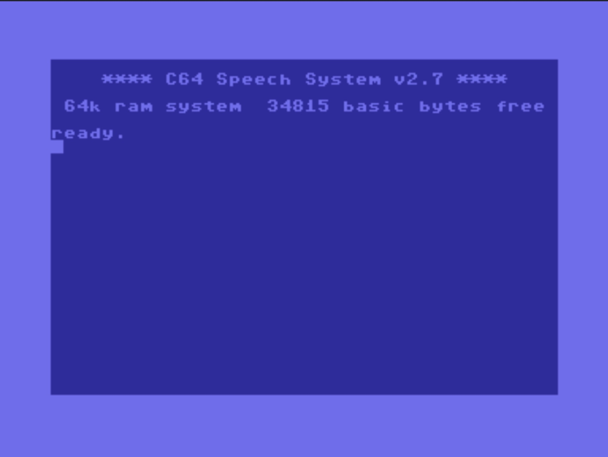
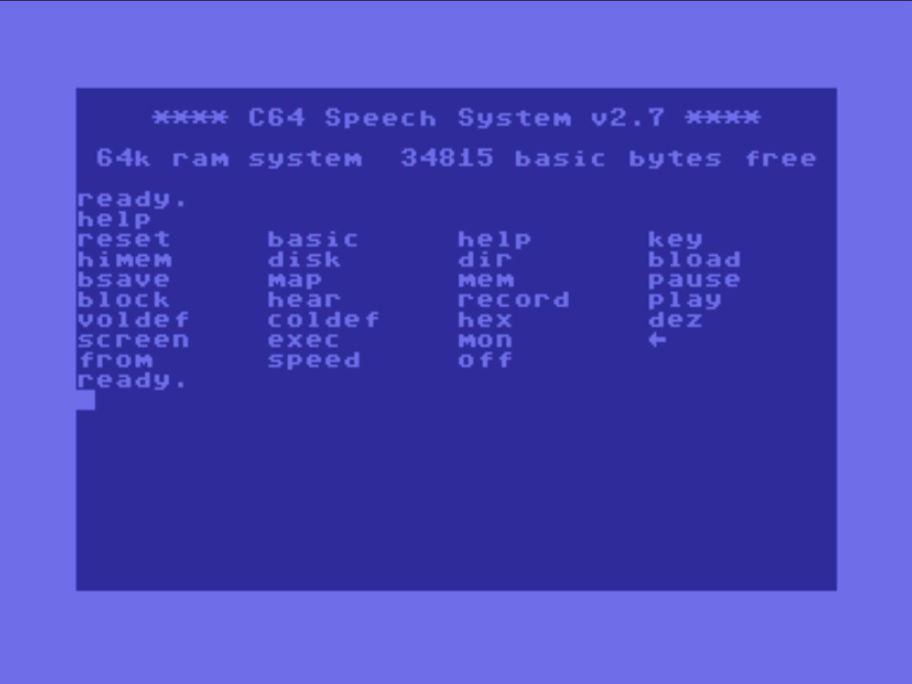
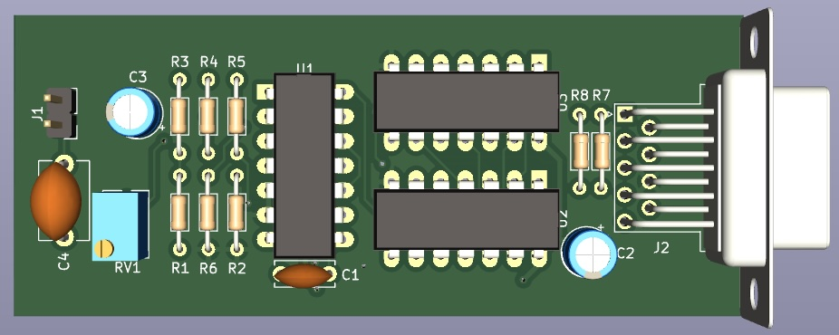
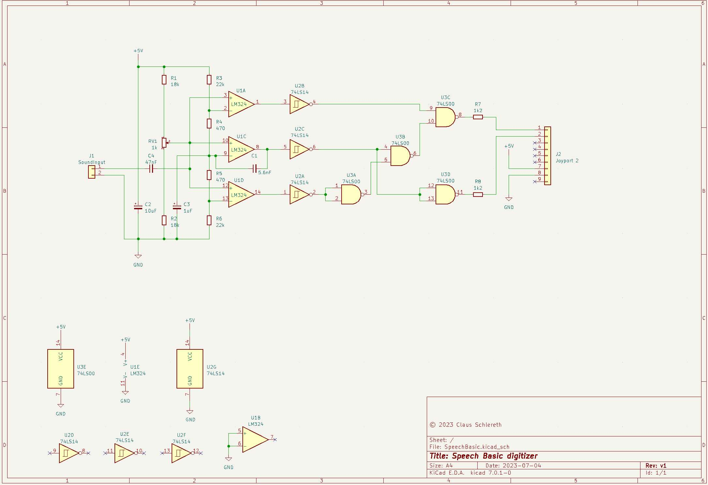

## SPEECH BASIC

### A BASIC EXTENSION FOR THE C64

This basic extension and the hardware were originally developed by Kristian
Köhntopp & Daniel Diezemann for the Commodore C64.

This Basic extension provides 23 new basic functions.

This source code is based on the existing disk images published by Markt &
Technik in 1986 in the German computer magazine "64'er 86/10".

At this point I would like to say many thanks to Kristian and Dana for giving
me the rights to the source code and the hardware circuit. So I can now publish
both here on GitHub.

You can find a short story of the history about Speech Basic written by Kristian
on his blog:

[MuT 64er 10/86](https://blog.koehntopp.info/2006/10/26/mut-64er-10-86.html)

> Speech Basic consists of a small circuit, namely a 2-bit audio digitizer and a
4-KByte Basic extension. Both together enable easy and comfortable working with
speech and music on the Commodore 64. The Speech Basic commands support working
in direct mode (for recording and simple playback of acoustic signals) as well
as in the program.
>   -- Translated from original text, published by Markt & Technik

### List of commands by group

| Group | Category | Commands                                      |
| --- | --- |-----------------------------------------------|
| a | Basic commands | `RESET`, `BASIC`, `HELP`                      |
| b | Utilities and disk commands | `KEY`, `MEM`, `DISK`, `DIR`, `BLOAD`, `BSAVE` |
| c | Sound commands | `HEAR`, `RECORD`, `PLAY`, `VOLDEF`, `COLDEF`  |
| d | Extended sound commands | `BLOCK`, `MAP`, `HIMEM`, `PAUSE`, `EXEC`      |
| e | Other commands | `BHEX`, `DEZ`, `SCREEN`, `MON`                |

Additional exec commands are `p`, `s`, `w`, `v`, `c`, `#`.

Details about the digitizer circuit and more detailed information about the
commands can be found at:

- https://archive.org/details/64er_1986_10/page/n63/mode/2up
- https://www.c64-wiki.de/wiki/Speech_Basic

### SPEECH BASIC Screenshots

| |                                                                                                                                   |
| --- |-----------------------------------------------------------------------------------------------------------------------------------|
|  |  |

### Digitizer example Screenshots

| |                                                                                                                             |
| --- |-----------------------------------------------------------------------------------------------------------------------------|
|  |  |

!! This layout is just an example. If you plan to build your own digitizer, you
should follow the descriptions in the relevant documents. !!

### Information about the source code

While creating and documenting the source code, I found some small errors and
unnecessary code parts.

1. The BLOAD command does not compare the load address with the Basic start
   address, so it is possible to overwrite the Speech-Basic main program.
2. The subroutine `checkparam`, which is used for DIR, DISK, BLOAD and also
   BSAVE, does not check whether the specified device exists. If a device number
   is entered which does not exist, the computer freezes.
3. The PAUSE command has a bug, sometimes skipping 255 bytes from the count
   value.

I have published 2 versions.

#### SpeechBasicV2.7.asm is the original code.

#### SpeechBasicV2.8.asm is the version where I have corrected these errors, and did some small code optimizations.

I have added information and comments to the source as much as possible, so that
it is easier to read and understand.

The documentation is maybe not perfect, but I think it is a good start.

### Remarks

Used Software:

- Visual Studio Code, Version: 1.75.1
- Acme Cross-Assembler for VS Code (c64) v0.0.18

Used Hardware:

- Apple iMac (24-inch, M1, 2021)

The source code can be compiled by using the Acme Cross Compiler (C64).

Please use this source code at your own risk ;)
